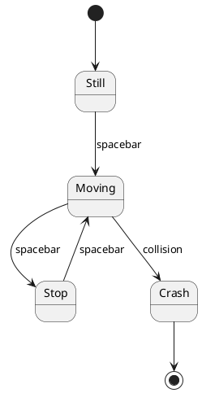

# BodeCrafting

**Model behavior. Let AI build the software.**

## What is BodeCrafting?

As a developer, you already create a model of the software you want to build in your head.

You think about states, transitions, conditions, happy paths, failures, inputs, outputs and how the system should behave. Then you translate that mental model into code.

**BodeCrafting captures this model explicitly and lets AI write the implementation for you.**

Instead of describing implementation details in long prompts, you describe the expected behavior of the software as a model.

The model becomes the specification that guides the AI when generating, changing, refactoring and testing the code.

## Why?

Behavior models provide several useful properties for AI-assisted software development:

- **Compact specification** — describe complex behavior with relatively little text.
- **Explicit happy and unhappy paths** — states and transitions make alternative paths visible.
- **Reusable behavior** — parts of a model can be reused in other features or projects.
- **Easier refactoring** — implementation can change while expected behavior remains stable.
- **Stable source of intent** — the model describes what the system should do independently of the current implementation.
- **Language and framework independent** — the same behavior can be implemented in Java, JavaScript, Python or another technology.

## Simple Example

Imagine a very small game where a car can start moving, stop and eventually crash.



Instead of explaining the implementation to an AI coding agent, give it the model and a simple instruction:

> Follow the behavior model and implement it. Write tests.

The model defines the expected behavior. The agent decides how to implement it in the selected language and framework.

## Basic Workflow

```text
Idea
  ↓
Behavior Model
  ↓
AI Coding Agent
  ↓
Code + Tests
```

When the software needs to change, change the behavior model first.

```text
Existing Model
      ↓
Change Behavior
      ↓
AI Coding Agent
      ↓
Updated Code + Tests
```

The implementation can evolve while the behavioral model continues to describe the intent of the system.

## BodeCrafting is not...

BodeCrafting is not:

- a new programming language
- a code generator
- tied to PlantUML
- an agent framework

PlantUML state diagrams are simply a convenient way to express behavioral models because they are compact, readable and easy for both humans and AI models to understand.

BodeCrafting is primarily a way to **represent software for AI at a higher level of abstraction**.

Instead of making source code the only representation of the system, the behavioral model captures the intent behind the code.

## Examples

This repository will contain small reproducible examples demonstrating the basic workflow:

```text
behavior model
      ↓
AI implementation
      ↓
tests
```

The goal is to show how far software can be built, changed and regenerated from explicit behavioral models.

---

**Model behavior. Let AI build the software.**
