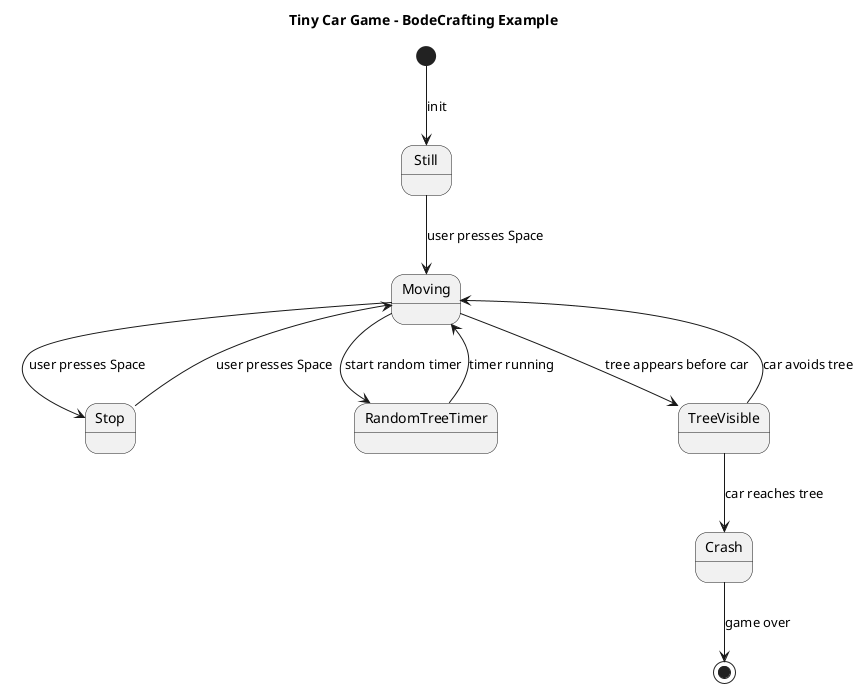

# BodeCrafting

Build software by modeling behavior first.

## What is BodeCrafting?

BodeCrafting is a behavior-first way of building software with AI. Instead of using a long natural-language prompt as the main source of truth, you describe software behavior as a small text-based state model. AI can then turn that model into code, tests, and documentation.

The name comes from the English verb “to bode”: to predict or foreshadow. A BodeCrafting model describes how software should behave before the implementation exists.

The model is usually a compact PlantUML state diagram. It describes:

- states
- events
- transitions
- guards
- side effects

The important point is that the diagram is not an image. It is text code. Rendering it as a picture can be useful, but rendering is optional. The text model is what matters.

In BodeCrafting, code is treated as generated output, not the primary holder of intent. The behavioral model is the source of truth.

## Why behavior models?

AI-assisted development can produce a lot of code quickly. That is useful, but it can also make you feel like a stranger in your own codebase. If the implementation becomes the only record of intent, reviewing, changing, or regenerating that code gets harder over time.

A small behavior model helps keep the intent visible.

It also narrows the solution space. Instead of asking an LLM to infer behavior from a large prompt, a large context window, memory, skills, or complex agent tooling, you give it a compact model that says what the software must do.

Skills can still help define the output style, language, framework, and conventions. For example, a skill might say:

- Java 21
- Spring Boot
- JUnit 5
- hexagonal architecture
- project-specific naming conventions

But the behavior model defines the software behavior.

That makes AI feel more compiler-like: not because the AI is a real compiler, but because the model constrains what should be generated.

## How it works

A practical BodeCrafting loop looks like this:

```text
Intent
  ↓
Text-based behavior model
  ↓
Reconstruct intent from model
  ↓
Compare original intent vs reconstructed intent
  ↓
Derive tests from transitions
  ↓
Generate implementation
  ↓
Generate documentation
```

The “reconstruct intent” step is important. Before generating code, ask the AI to explain what the model means. If the explanation does not match your intent, fix the model first.

This keeps the workflow lightweight. A text file and an LLM are enough to start.

## First example: a tiny car game state model

Here is a small PlantUML state diagram for a tiny JavaScript car game:



In this model:

- `Still`, `Moving`, `Stop`, `TreeVisible`, and `Crash` are states.
- `user presses Space`, `tree appears`, and `car reaches tree` are events.
- Each arrow is a transition.
- Each transition can become a test case.

The model is intentionally small. It does not try to describe every pixel, variable, or line of code. It describes the behavior that must remain true.

## Generate tests from transitions

Tests can be derived naturally from state transitions. Each transition describes a starting state, an event, and an expected next state.

Example test cases in plain English:

```text
Given the game is Still
When the user presses Space
Then the game becomes Moving

Given the game is Moving
When the user presses Space
Then the game becomes Stop

Given the game is Stop
When the user presses Space
Then the game becomes Moving

Given the game is TreeVisible
When the car reaches the tree
Then the game becomes Crash

Given the game is Crash
Then the game is over
```

From there, an AI assistant can generate unit tests, integration tests, browser tests, or documentation examples depending on the target stack.

The transition list also makes gaps easier to see. For example:

- What happens if Space is pressed while `TreeVisible`?
- Does `Stop` pause the random tree timer?
- What counts as “car avoids tree”?
- Is `RandomTreeTimer` a real game state or an implementation detail?

Those questions are cheaper to answer in the model than after a full implementation exists.

## Ask AI to implement it

You can copy this prompt into any LLM:

```text
You are an AI coding assistant.

Use the following PlantUML state diagram as the source of truth.

First:
1. Explain the behavior in plain English.
2. Derive test cases from all transitions.
3. Identify missing guards or ambiguous transitions.
4. Then implement the smallest working version.

Target:
- One HTML file
- Plain JavaScript
- No external libraries
- Draw a simple 2D car moving on the x-axis
- Space starts/stops the car
- A tree appears randomly
- If the car reaches the tree while moving, the game enters Crash state
- Keep the implementation aligned with the state model

[PASTE STATE DIAGRAM HERE]
```

The prompt is deliberately simple. The state model carries the behavioral detail. The prompt tells the AI how to use it.

## Not against vibe coding

BodeCrafting is not against vibe coding.

Vibe-coded code can be treated as a carrier of intent. If you already have code that mostly works, you can ask AI to extract its behavior into a sequence diagram or another intermediate description. Then you can distill that behavior into a smaller state model.

Once the state model exists, you can use it to regenerate cleaner code in another language or framework.

For example:

```text
Existing code
  ↓
Extract observed behavior
  ↓
Sequence diagram
  ↓
State model
  ↓
Tests
  ↓
Regenerated implementation
```

This is useful for migrations, rewrites, and cleanup work where the old code contains valuable behavior but poor structure.

## What this repository will contain

This repository will collect small BodeCrafting examples and experiments, including:

- tiny game example
- worker / background job example
- form submission flow
- legacy code to state model
- Play Framework 1.x to Spring Boot migration experiment
- model to tests
- model to documentation

The goal is to keep the examples practical and easy to copy into real development workflows.

## Status / experiment note

This repository is experimental. The goal is not to create another heavy framework. The goal is to show that a small text-based behavior model can make AI coding more predictable, testable, and easier to review.
